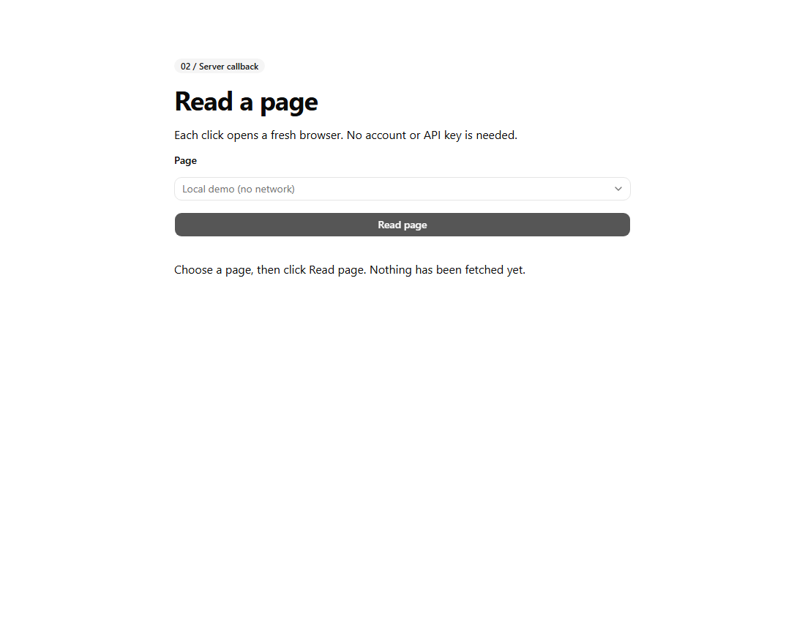
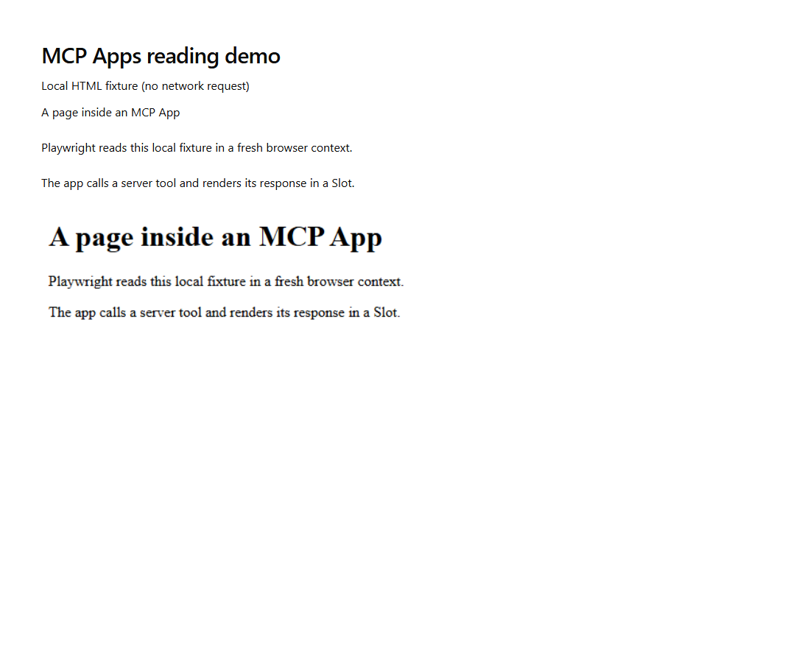

# MCP Apps — Playwright browser panel

This sample targets the independently versioned **Apps extension 2026-01-26**,
not a core MCP protocol release. The [official Apps overview](https://modelcontextprotocol.io/docs/extensions/apps)
links to the [2026-01-26 specification](https://github.com/modelcontextprotocol/ext-apps/blob/main/specification/2026-01-26/apps.mdx).
Apps add embedded UI and host-mediated tool callbacks; they are not SDK 2-only.

`browser_panel` returns the UI shell. **Read page** sets a busy flag and uses
`CallTool("inspect_page")`; the helper opens a fresh Chromium context and returns
a new `PrefabApp` containing the page title, up to 2,000 characters of body text,
and an 800 × 450 viewport PNG. `SetState("result", RESULT)` passes that component
tree to `Slot("result")`. Both success and error callbacks clear the busy flag.

## Screenshots

Actual standalone shell preview. The button needs an MCP Apps host to call tools.



Actual result component from invoking `inspect_page("demo")` locally with
Playwright, rendered separately. This is not a host button-callback capture.



## Run and test

From the repository root, with Python 3.13+ and `uv` installed:

```powershell
uv sync --directory mcp_learning_samples/apps_browser --default-index https://packagefeedproxy.microsoft.io/pypi/simple/
uv run --directory mcp_learning_samples/apps_browser playwright install chromium
uv run --directory mcp_learning_samples/apps_browser python -m unittest -v
```

Chromium is a separate download. If enterprise policy blocks it, use your
organization's approved Playwright browser installation procedure; the Python
package proxy alone does not provide browser binaries.

The automated test starts the stdio server, calls the shell and callback tools,
and launches real Chromium against a **local HTML fixture**. No external website,
LLM, or account is needed. The fixture is explicitly labeled; it is not presented
as a live web fetch. Unsupported page IDs must produce an MCP tool error.

## Connect an MCP Apps host

Merge this entry into an Apps-capable host's MCP settings manually, adjusting
the checkout and executable paths. This is VS Code's `servers` format; some other
hosts use `mcpServers`. The existing repository configuration is unchanged.

```json
{
  "servers": {
    "prefab-browser": {
      "type": "stdio",
      "command": "uv",
      "args": ["run", "--directory", "D:/Code/mcp-aoai-web-browsing/mcp_learning_samples/apps_browser", "python", "server.py"]
    }
  }
}
```

1. Ask the host to **call `browser_panel` to open the interactive browser panel**.
2. Keep **Local demo** selected and click **Read page**.
3. Expect a title, body text, and captured screenshot in place of the placeholder.
4. Optionally choose **example.com** to make an external request. Network or
   navigation errors should appear as text and re-enable the button.

Both the model and UI can call `inspect_page`. The explicit
`visibility=["app", "model"]` is for compatibility with ordinary tool dispatch
in the installed FastMCP version, not an authorization mechanism.

## Layout-only preview

```powershell
uv run --directory mcp_learning_samples/apps_browser prefab serve preview.py --port 5176 --reload
```

This shows the shell and selection control. **Read page cannot fetch a page in
standalone preview**, because `CallTool` needs an MCP Apps host. Use the stdio
test for backend verification and a supported chat host for the full UI callback.
The original Tk GUI does not render these Apps.

## Scope and safety

- Only the local fixture and a fixed HTTPS example.com page are offered; no
  arbitrary URLs, file access, login, persistent cookies, or browser sessions.
- Requests, redirects, and subresources are restricted to that HTTPS origin;
  service workers are disabled. This is not a substitute for production network
  isolation, DNS controls, authentication, quotas, or sandboxing.
- Page content is untrusted data placed in state and rendered as text, never
  inserted as executable HTML or used as an instruction.
- Every call closes its browser in `finally`. Navigation has a 15-second timeout.
- The renderer uses a CDN; an offline browser fixture does not make the host UI
  itself offline. No external-page availability is claimed by the tests.

## Requirements and references

This sample uses FastMCP 3.2.0, Prefab 0.20.2 and MCP SDK 1.27.0.
Its package configuration selects the Microsoft package proxy; `uv` does not
read pip configuration. The renderer loads JavaScript from `cdn.jsdelivr.net`.

The host reads `ui://prefab/renderer.html` and supplies the structured component
tree to it. Button actions call the server through the host, and `Slot` displays
the returned UI. Embedding and button callbacks in a third-party host remain a
separate manual check.

- [Prefab FastMCP integration](https://prefab.prefect.io/docs/running/fastmcp)
- [Prefab actions](https://prefab.prefect.io/docs/concepts/actions)
- [MCP Apps extension](https://modelcontextprotocol.io/docs/extensions/apps)
- [All learning samples](../../README.md#learning-samples)