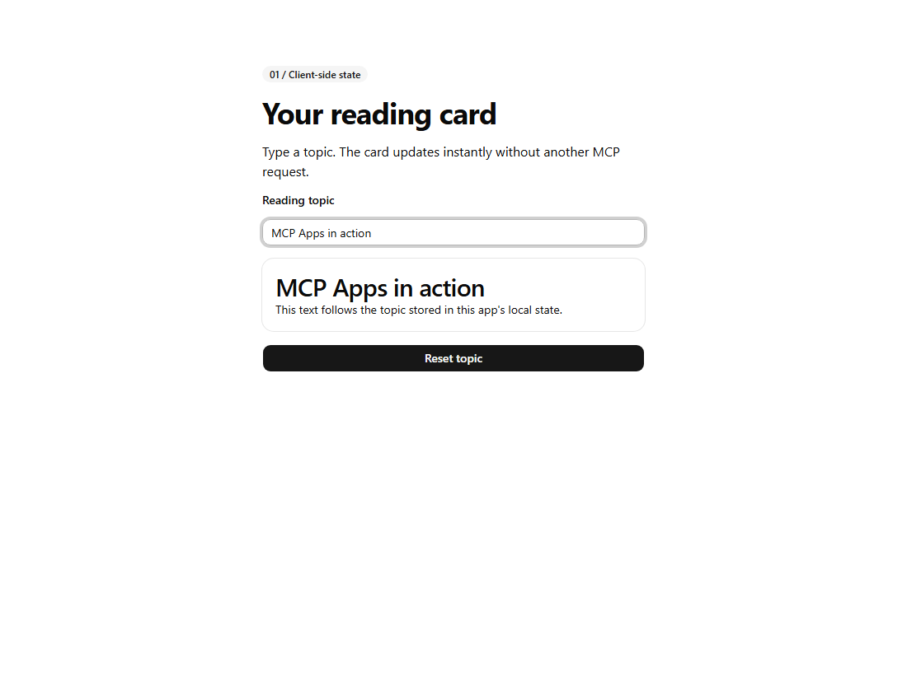

# MCP Apps — Reactive reading card

This sample targets the independently versioned **Apps extension 2026-01-26**,
not a core MCP protocol release. The [official Apps overview](https://modelcontextprotocol.io/docs/extensions/apps)
links to the [2026-01-26 specification](https://github.com/modelcontextprotocol/ext-apps/blob/main/specification/2026-01-26/apps.mdx).
Apps add embedded UI and host-mediated interaction; they are not SDK 2-only.

The smallest sample: `@mcp.tool(app=True)` returns a `PrefabApp`. The input's
`name="topic"` binds it to client state; `SetState` resets the topic. After the
initial tool call, neither typing nor resetting makes a server request.

## Screenshot

Actual standalone Prefab preview after typing a topic. Input and reset were
checked locally; this is not a screenshot of an MCP chat host.



## Run and test

From the repository root, with Python 3.13+ and `uv` installed:

```powershell
uv sync --directory mcp_learning_samples/apps_reactive --default-index https://packagefeedproxy.microsoft.io/pypi/simple/
uv run --directory mcp_learning_samples/apps_reactive python -m unittest -v
uv run --directory mcp_learning_samples/apps_reactive prefab serve preview.py --reload
```

The preview prints its local URL (normally port 5175). Type a topic and click
**Reset topic**. The heading should follow the input and return to **MCP Apps**.
Stop the preview with Ctrl+C. Preview mode may log an unavailable MCP bridge;
it can still exercise client-side state, but is not a chat-host integration test.

## Connect an MCP Apps host

Add this server to a host that supports **both stdio and MCP Apps**. For VS Code's
MCP configuration format, merge the following entry manually; the repository's
existing configuration is intentionally unchanged. Replace the absolute path
with your checkout location, and use an absolute `uv` executable path if the host
cannot find it. Other hosts may use `mcpServers` instead of `servers`.

```json
{
  "servers": {
    "prefab-reactive": {
      "type": "stdio",
      "command": "uv",
      "args": ["run", "--directory", "D:/Code/mcp-aoai-web-browsing/mcp_learning_samples/apps_reactive", "python", "server.py"]
    }
  }
}
```

Ask the host to **call `reading_card` to open the interactive reading card**.
Merely running `python server.py` in a terminal starts stdio and waits for a
client; it does not open a web page. The unit test launches and closes that
subprocess automatically, inspects the UI metadata/resource, and checks that the
returned UI contains local actions but no `CallTool` action.

## Requirements and references

This sample uses FastMCP 3.2.0, Prefab 0.20.2 and MCP SDK 1.27.0.
Its package configuration selects the Microsoft package proxy; `uv` does not
read pip configuration. The renderer loads JavaScript from `cdn.jsdelivr.net`.
Package installation and renderer access require the corresponding network permissions.

The host reads `ui://prefab/renderer.html` and supplies the tool's structured
component tree to it. Tests verify this resource and response structure, not
embedding in a third-party host.

- [Prefab FastMCP integration](https://prefab.prefect.io/docs/running/fastmcp)
- [MCP Apps extension](https://modelcontextprotocol.io/docs/extensions/apps)
- [All learning samples](../../README.md#learning-samples)