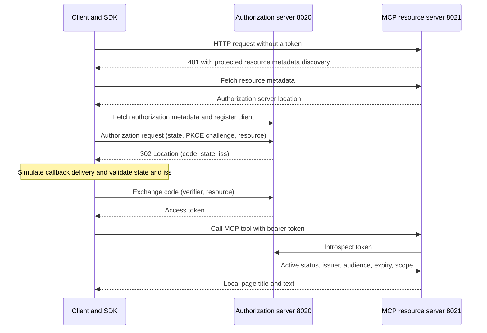

# MCP v2 — Local OAuth architecture

This sample shows how a client obtains a token and calls a protected MCP tool.
It separates the real SDK path from an SDK-independent lab that checks OAuth
rules. It is an introduction, not a production identity service or deployment design.

See the [specification references](../../README.md#specification-references) for the MCP v1/v2 comparison.
The target is the [core MCP 2026-07-28 specification](https://modelcontextprotocol.io/specification/2026-07-28),
not an SDK package version. The client explicitly selects `mode="2026-07-28"`;
its `mcp==2.2.0` integration remains blocked and unverified. This sample does not
implement the independently versioned MCP Apps UI extension.

## Three participants

- **Client:** [client.py](client.py) uses the SDK's `OAuthClientProvider` to authorize requests and call MCP tools. Registration information and tokens stay in memory for the current run.
- **Authorization server:** [support/auth_server.py](support/auth_server.py) is a fixture at `127.0.0.1:8020` that registers clients and issues and exchanges codes. It automatically approves requests instead of presenting login and consent screens.
- **MCP resource server:** [server.py](server.py) protects `127.0.0.1:8021/mcp`. Only authenticated requests can call `read_demo_page`, which reads local HTML with Playwright.

## Essential checks

**Issuer** identifies the authorization server. When a callback includes `iss`,
it must exactly match the issuer from validated metadata, without URL normalization
such as removing a trailing slash. This fixture advertises issuer support, so a
missing value is also rejected. Validation precedes code exchange and OAuth error
handling to prevent confusing responses from different servers.

**State** is a random value connecting an authorization request to its response.
A mismatch is rejected to avoid mixing callbacks from different requests.
The callback destination must match the registered URI, and duplicate query
parameters are rejected.

**PKCE** binds the authorization code to the client that started the flow.
The client sends an S256 hash of a secret verifier, then presents the verifier
when exchanging the code. The authorization server checks it along with the
client, redirect URI and code expiry. A code cannot be reused after an exchange attempt.

**Resource** identifies the intended token destination, `http://127.0.0.1:8021/mcp`.
Authorization and code exchange require the same destination, which is recorded
in the token's `aud` field. The MCP server checks active status, issuer, audience
and expiry through introspection; the SDK auth settings require `browser:read`.
Access is denied if introspection fails.

## Simulated behavior and suggested reading

The registered callback URI is `http://127.0.0.1:8022/callback`, but **there is no
listener on port 8022**. The client captures a 302 from the allowed local
authorization endpoint and passes its parameters to the SDK's
`AuthorizationCodeResult`. It does not follow the redirect or modify the state
and issuer values. Login and callback delivery are simulated; the MCP path is
configured to use the real SDK HTTP client and server.

[lab/demo.py](lab/demo.py) is a separate path. [lab/lab_support.py](lab/lab_support.py) starts an
authorization server on a temporary port and checks OAuth rules with standard-library
HTTP requests. The valid flow should exchange a token once; wrong or missing
issuers should cause zero exchanges. These results and passing
[tests/test_auth.py](tests/test_auth.py) checks do not establish SDK integration success.

Start with [client.py](client.py) and [server.py](server.py); try
[lab/demo.py](lab/demo.py) separately for the SDK-independent exercise.
[support/auth_server.py](support/auth_server.py), [support/auth_rules.py](support/auth_rules.py), and
[lab/lab_support.py](lab/lab_support.py) are supporting code; beginners need not read every
detail. The fixture retains loopback binding, Host/Origin checks and suppression
of sensitive logs. However, it uses HTTP and unauthenticated introspection. Real
user authentication, TLS, persistent storage, token refresh and revocation are out of scope.

The real SDK path remains unverified because the approved package proxy cannot
resolve `mcp==2.2.0`. [support/runtime_check.py](support/runtime_check.py) prevents execution with
another version. See [README.md](README.md) for manual success/failure checks and
related specifications.